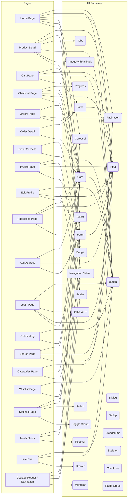

# Component Diagram: Pages → UI Primitives

Below is a Mermaid diagram mapping major pages to the UI primitives they use.

```mermaid
flowchart LR
  subgraph Pages
    Home[Home Page]
    Product[Product Detail]
    Cart[Cart Page]
    Checkout[Checkout Page]
    Orders[Orders Page]
    OrderDetail[Order Detail]
    OrderSuccess[Order Success]
    Profile[Profile Page]
    EditProfile[Edit Profile]
    Addresses[Addresses Page]
    AddAddress[Add Address]
    Login[Login Page]
    Onboarding[Onboarding]
    Search[Search Page]
    Categories[Categories Page]
    Wishlist[Wishlist Page]
    Settings[Settings Page]
    Notifications[Notifications]
    LiveChat[Live Chat]
    Header[Desktop Header / Navigation]
  end

  subgraph UI[UI Primitives]
    Button(Button)
    Input(Input)
    InputOTP(Input OTP)
    Select(Select)
    Form(Form)
    Card(Card)
    Table(Table)
    Pagination(Pagination)
    Tabs(Tabs)
    Carousel(Carousel)
    Dialog(Dialog)
    Drawer(Drawer)
    Popover(Popover)
    Tooltip(Tooltip)
    Avatar(Avatar)
    Badge(Badge)
    Menu(Navigation / Menu)
    Menubar(Menubar)
    Breadcrumb(Breadcrumb)
    Skeleton(Skeleton)
    Progress(Progress)
    Switch(Switch)
    Checkbox(Checkbox)
    Radio(Radio Group)
    ToggleGroup(Toggle Group)
    ImageFallback(ImageWithFallback)
  end

  %% Home
  Home --> Card
  Home --> Carousel
  Home --> Menu
  Home --> Pagination
  Home --> Button
  Home --> Input

  %% Product
  Product --> Card
  Product --> ImageFallback
  Product --> Button
  Product --> Tabs
  Product --> Badge
  Product --> Input

  %% Cart
  Cart --> Table
  Cart --> Button
  Cart --> Input
  Cart --> Card

  %% Checkout
  Checkout --> Form
  Checkout --> Input
  Checkout --> Select
  Checkout --> Card
  Checkout --> Progress

  %% Orders
  Orders --> Table
  Orders --> Pagination
  Orders --> Card

  %% Order detail
  OrderDetail --> Card
  OrderDetail --> Table

  %% Order success
  OrderSuccess --> Card
  OrderSuccess --> Badge

  %% Profile / Edit
  Profile --> Form
  Profile --> Input
  Profile --> Avatar
  Profile --> Button
  EditProfile --> Form
  EditProfile --> Input
  EditProfile --> Avatar
  EditProfile --> Button

  %% Addresses
  Addresses --> Form
  Addresses --> Input
  Addresses --> Card
  AddAddress --> Form
  AddAddress --> Input
  AddAddress --> Card

  %% Auth / Onboarding
  Login --> Form
  Login --> Input
  Login --> InputOTP
  Login --> Button
  Onboarding --> Carousel
  Onboarding --> Button

  %% Search / Categories
  Search --> Input
  Search --> Pagination
  Search --> Card
  Categories --> Menu
  Categories --> Card
  Categories --> Pagination

  %% Wishlist / Settings / Notifications
  Wishlist --> Card
  Wishlist --> Button
  Settings --> ToggleGroup
  Settings --> Switch
  Settings --> Select
  Settings --> Form
  Notifications --> Popover
  Notifications --> Card
  Notifications --> Badge

  %% Live chat and header
  LiveChat --> Drawer
  LiveChat --> Input
  LiveChat --> Button
  Header --> Menubar
  Header --> Menu
  Header --> Avatar
  Header --> Badge

  %% Shared primitives
  Card --- Button
  Form --- Input
  Table --- Pagination

```